<br>


---

# 🎓 Smart Academic Assistant Pro

> 🧠 A scalable GEN AI-powered academic platform that leverages Generative AI to deliver personalized study materials, adaptive quizzes, and intelligent learning workflows through a full-stack architecture.

---

## 🚀 Live Demo

🌐 Frontend:  
https://smart-academic-assistant-pro.streamlit.app

⚙️ Backend API:  
https://advanced-ai-learning-1-w542.onrender.com

🧠Server will run at:
http://localhost:8000

📚 API Docs:  
http://localhost:8000/docs

---

## 🧠 Overview

**AI-Powered Academic Learning Platform** is a full-stack, production-ready EdTech system that leverages **Generative AI (Groq LLM)** to deliver personalized, scalable, and intelligent learning experiences.

The platform is designed for **School Students, College Learners, and Competitive Exam Aspirants**, providing adaptive content, automated assessments, and real-time learning insights.

---

## ✨ Core Features

### 🤖 AI-Powered Content Generation
- Dynamic study material generation using **Groq LLM (llama-3.3-70b-versatile)**
- Multi-level content delivery: **Beginner → Intermediate → Advanced**
- Structured outputs (definition, concepts, examples, summaries)
- Context-aware explanations for better understanding

---

### 📝 Intelligent Quiz Engine
- AI-generated MCQs with **detailed explanations**
- Difficulty-based adaptive question generation
- Real-time evaluation and feedback system
- Designed for **concept reinforcement and assessment**

---

### 🧠 AI Mindmap Generator
- Automated **learning roadmap creation**
- Hierarchical concept breakdown
- Helps users visualize and structure knowledge
- Supports faster revision and long-term retention

---

### 🔐 Secure Authentication System
- User registration & login with **hashed passwords (bcrypt)**
- Role-based access control:
  - 🏫 School Students  
  - 🎓 College Students  
  - 🎯 Exam Aspirants  
- Persistent user data using JSON storage

---

### 📊 Smart Dashboard & Analytics
- Personalized learning dashboard
- Progress tracking and performance insights
- Daily & weekly study planning
- Goal tracking for consistent learning

---

### 📄 PDF Generation System
- Automated generation of **downloadable study materials**
- Structured formatting using **ReportLab**
- Useful for offline learning and revision

---

### 💾 Data Persistence Layer
- Lightweight storage using **JSON-based database**
- Stores:
  - User data  
  - Chat history  
  - Generated content  
- Easy to extend to SQL / NoSQL systems

---

### ⚙️ REST API Backend (FastAPI)
- High-performance backend built with **FastAPI**
- Modular API architecture
- Endpoints for:
  - Content generation  
  - Quiz generation  
  - Mindmap generation  
  - Authentication  
- Auto-documented via `/docs` (Swagger UI)

---

### 🎨 Interactive Frontend (Streamlit)
- Responsive and interactive UI using **Streamlit**
- Real-time AI interaction
- Clean UX for seamless learning experience

---

## 🏗️ System Capabilities

- ⚡ Real-time AI response generation  
- 🧩 Modular and scalable architecture  
- 🔄 API-driven communication (Frontend ↔ Backend)  
- ☁️ Deployment-ready (Render + Streamlit Cloud)  
- 🔐 Secure environment variable handling  

---

## 🎯 Target Use Cases

- AI-based learning platforms  
- Smart study assistants  
- EdTech SaaS applications  
- Academic content generation tools  
- Personalized education systems  

---

## 📸 Screenshots

### 🔐 Login / Register
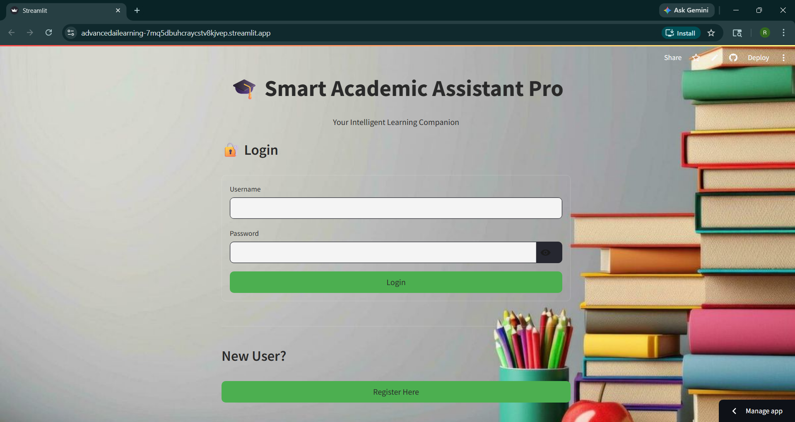
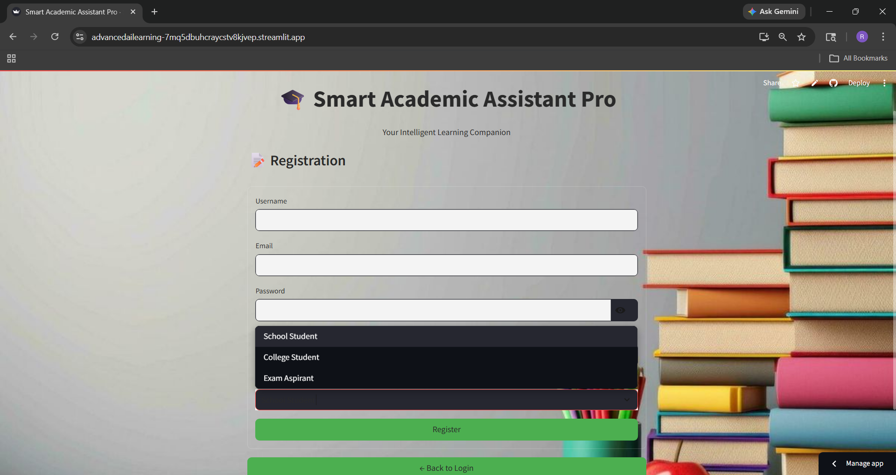

---

### 🏫 School
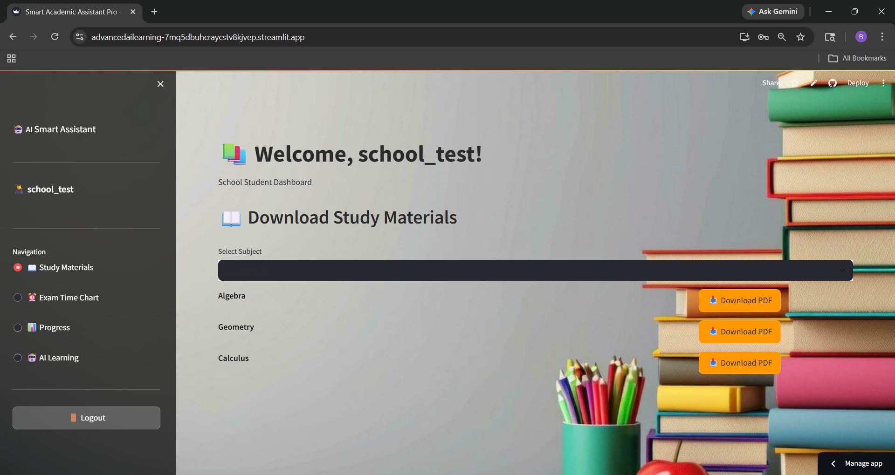
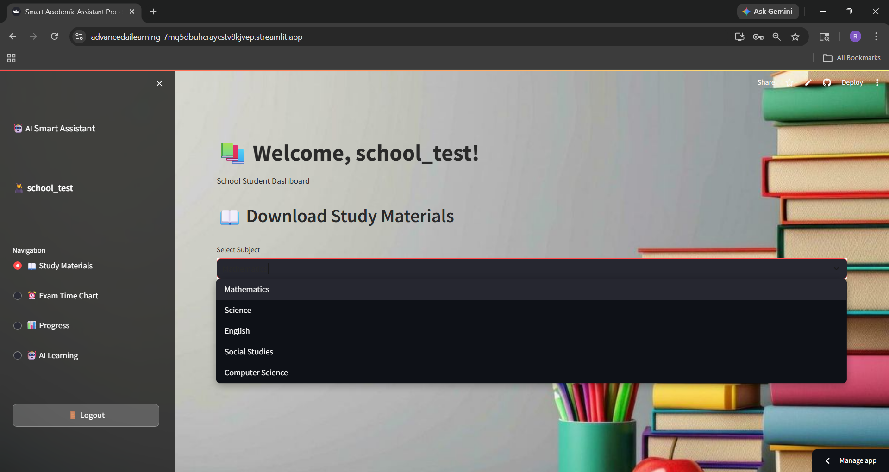
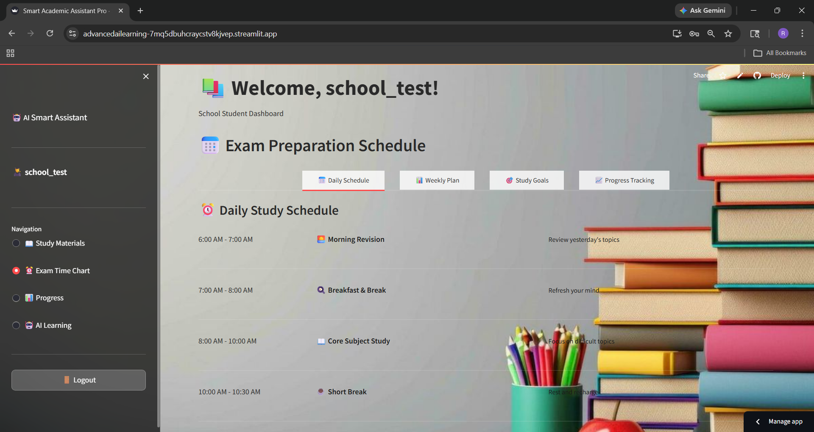
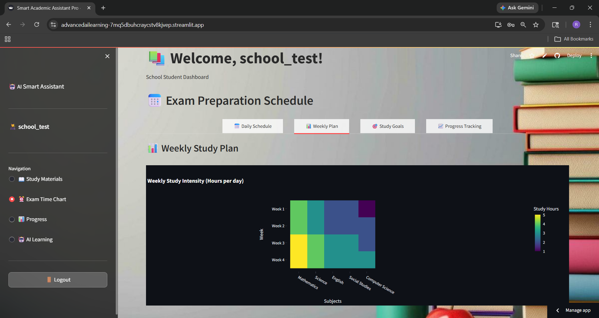
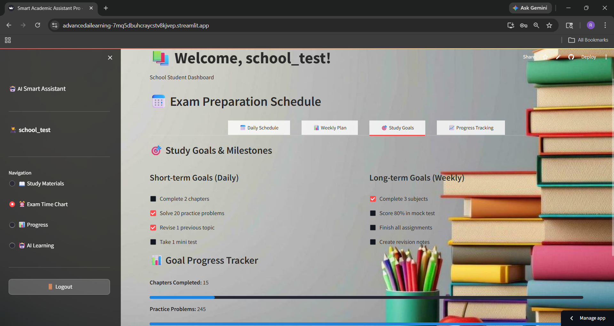
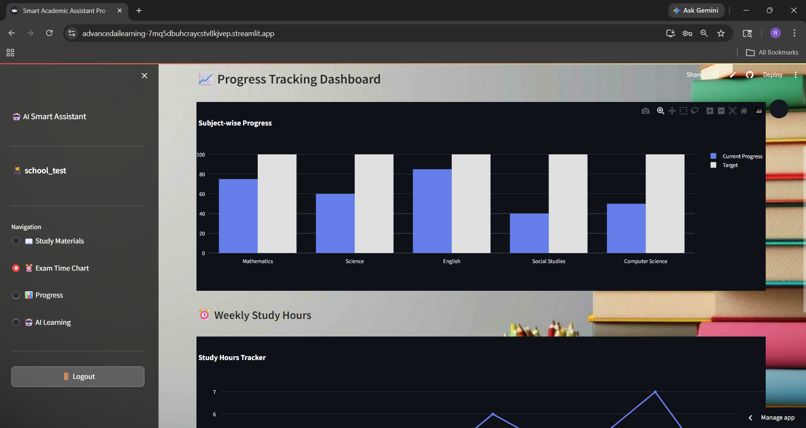

---

### 🎓 College
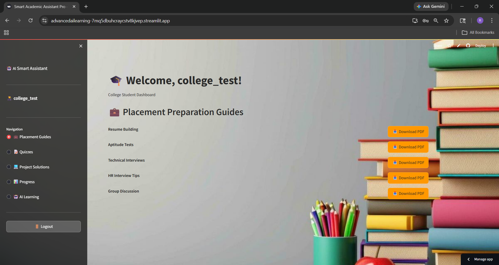
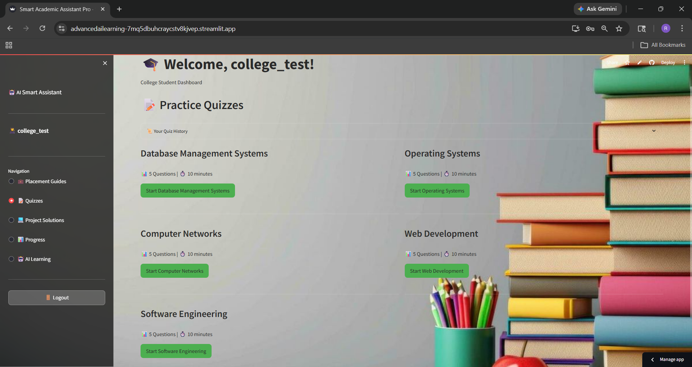
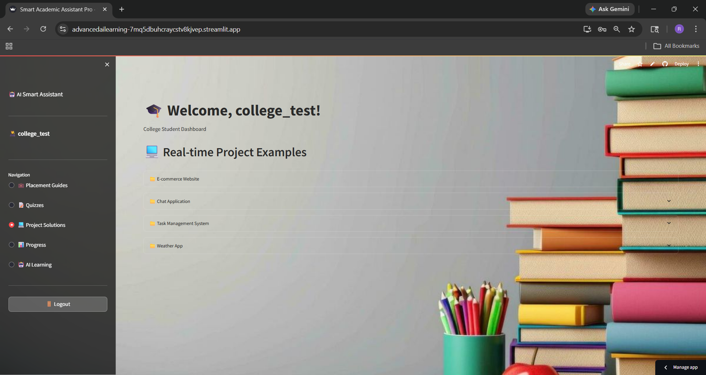
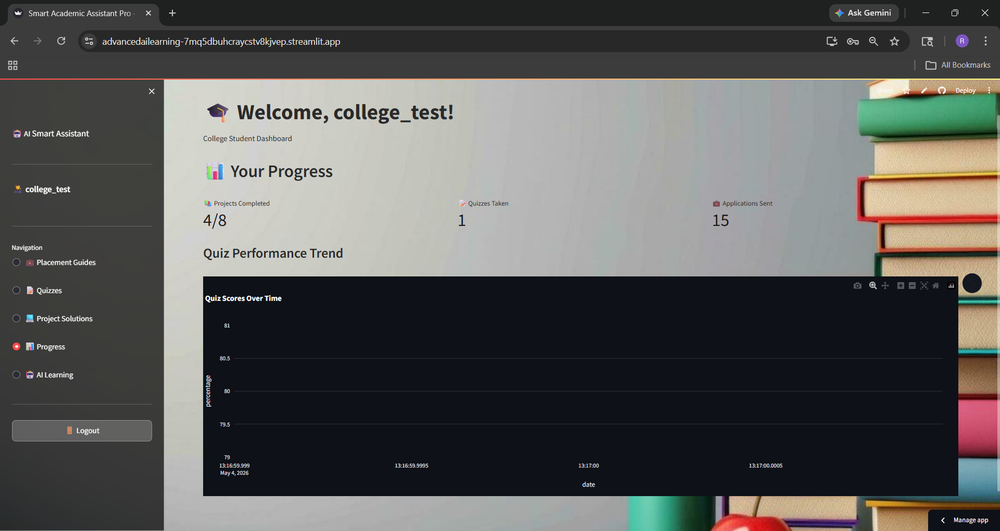

---

### 🎯 Exam Aspirant
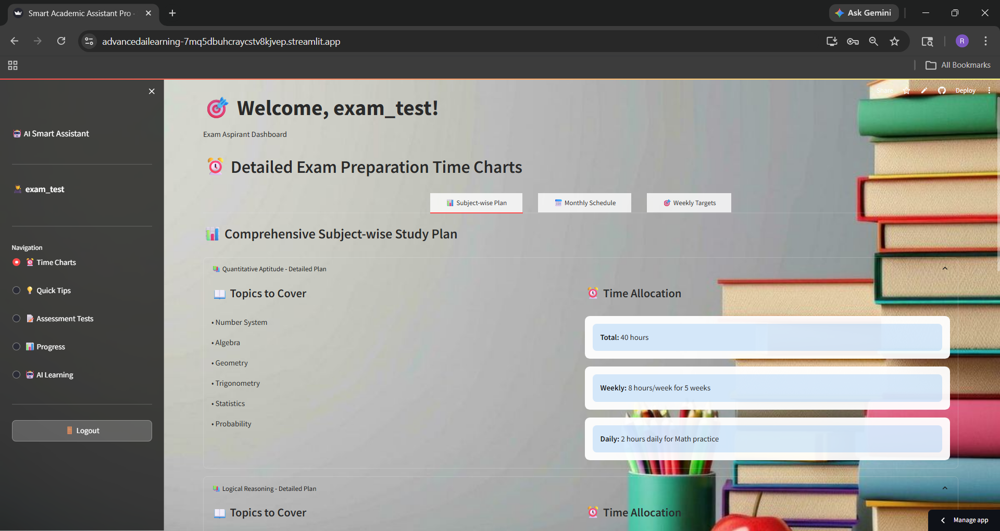
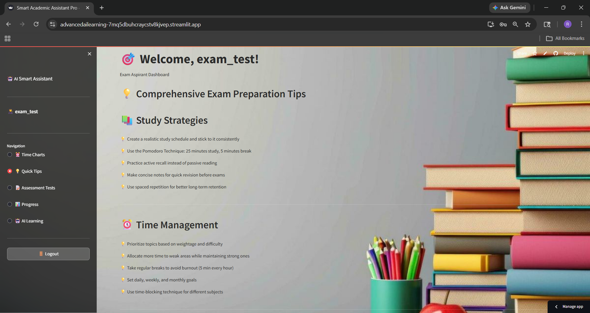
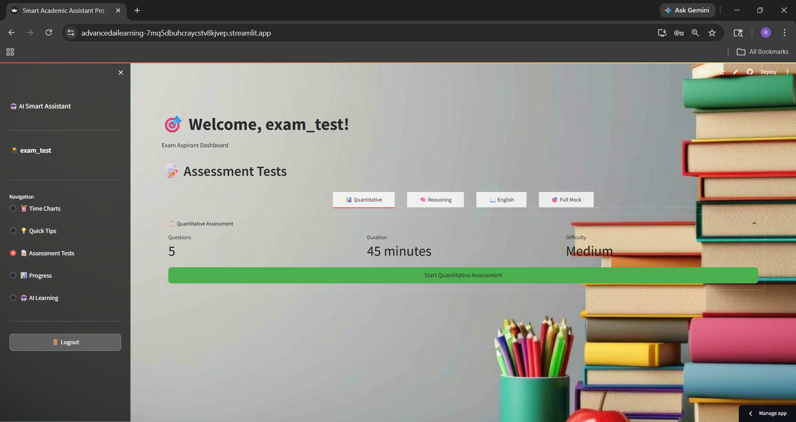
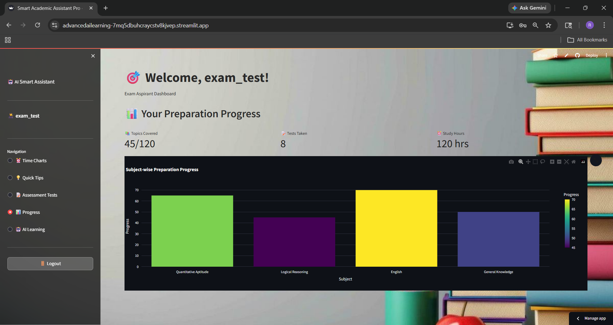

---

### 🤖 AI Features
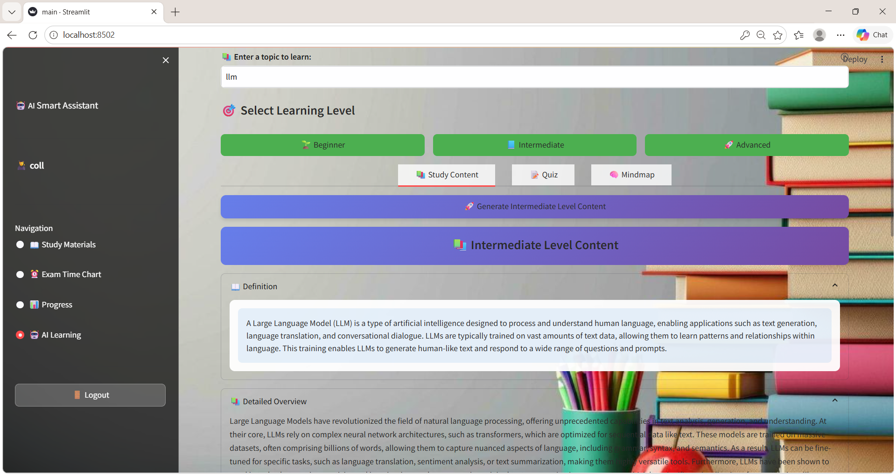
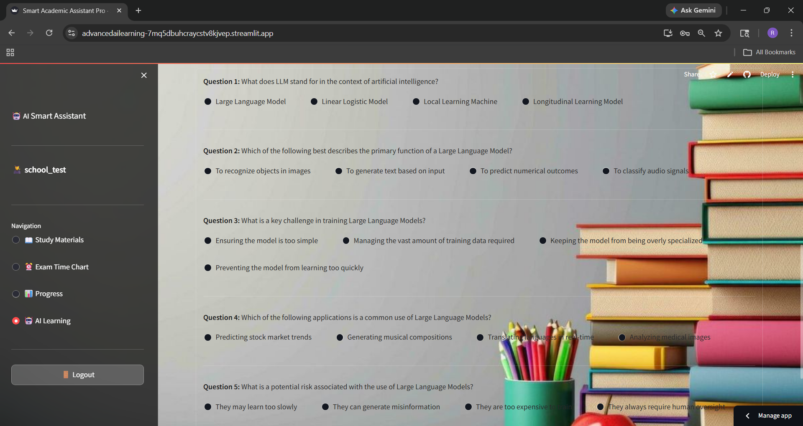
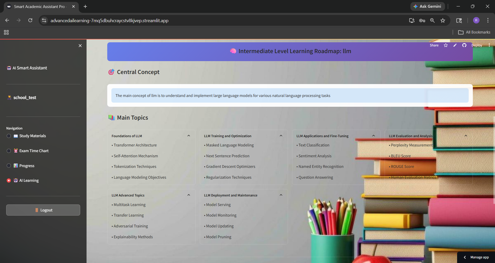

---

## 🧠 Tech Stack

### 🧩 Core Technologies
- **Python 3.11** – Primary programming language  
- **FastAPI** – High-performance backend API framework  
- **Streamlit** – Interactive frontend UI framework  

---

### 🤖 AI & Machine Learning
- **Groq API** – Ultra-fast LLM inference engine  
- **LLaMA 3.3 (70B Versatile)** – Generative AI model for:
  - Content generation  
  - Quiz creation  
  - Mindmap generation  

---

### ⚙️ Backend & API Layer
- **Uvicorn** – ASGI server for FastAPI  
- **Pydantic** – Data validation & schema management  
- **REST API Architecture** – Modular endpoint design  

---

### 🎨 Frontend & Visualization
- **Streamlit UI Components** – Interactive dashboards  
- **Plotly** – Data visualization & progress charts  
- **Custom CSS Styling** – Enhanced UI/UX experience  

---

### 🔐 Authentication & Security
- **bcrypt** – Secure password hashing  
- **Environment Variables (.env)** – Secret management  
- **CORS Middleware** – Cross-origin request handling  

---

### 💾 Data Storage & Persistence
- **JSON-based Storage** – Lightweight data handling:
  - Users  
  - Chat history  
  - Generated content  
- Easily extendable to:
  - PostgreSQL  
  - MongoDB  

---

### 📄 Document Generation
- **ReportLab** – Dynamic PDF generation for study materials  

---

### ☁️ Deployment & DevOps
- **Render** – Backend deployment (FastAPI)  
- **Streamlit Cloud** – Frontend deployment  
- **Docker** – Containerization support  
- **GitHub** – Version control & CI-ready workflow  

---

### 🧪 Development & Utilities
- **python-dotenv** – Environment configuration  
- **httpx** – Async HTTP requests  
- **Modular Project Architecture** – Scalable code structure  

---

## 🏗️ Architecture Style

- 🔹 Client–Server Architecture  
- 🔹 API-Driven Communication  
- 🔹 Modular Service-Based Design  
- 🔹 AI-Integrated Backend System  

---

## 📁 Project Structure

```bash
personal-ai-learning-platform-v1/
│
├── app/
│   ├── __pycache__/
│   │
│   ├── api/
│   │   ├── __pycache__/
│   │   └── routes.py
│   │
│   ├── auth/
│   │   ├── __pycache__/
│   │   └── auth.py
│   │
│   ├── services/
│   │   ├── __pycache__/
│   │   └── llm_service.py
│   │
│   └── config.py
│
├── assets/
│   │
│   ├── user_access/
│   │   ├── login.png
│   │   └── register.png
│   │
│   ├── school/
│   │   ├── dashboard.png
│   │   ├── study_materials.png
│   │   ├── schedule_daily.png
│   │   ├── schedule_weekly.png
│   │   ├── goals_tracking.png
│   │   └── progress_chart.png
│   │
│   ├── college/
│   │   ├── placement_guides.png
│   │   ├── quizzes.png
│   │   ├── projects.png
│   │   └── progress.png
│   │
│   ├── exam_aspirant/
│   │   ├── study_plan.png
│   │   ├── tips.png
│   │   ├── assessment.png
│   │   └── progress.png
│   │
│   └── ai_features/
│       ├── content_generation.png
│       ├── quiz_generation.png
│       └── mindmap_generation.png
│
├── data/
│   ├── pdfs/
│   ├── chats.json
│   └── users.json
│
├── frontend/
│   ├── __pycache__/
│   └── app.py
│
├── venv/
│
├── .dockerignore
├── .env
├── .gitignore
├── Dockerfile
├── fastapi_server.py
├── main.py
├── run_all.py
├── requirements.txt
├── render.yaml
├── README
├── License
```
---

## ⚙️ Installation

### 1️⃣ Clone Repository
```bash
git clone https://github.com/22AD040/Advanced_AI_Learning.git
cd personal-ai-learning-platform-v1
```

### 2️⃣ Create Virtual Environment
```bash
python -m venv venv
```

### 3️⃣ Activate Environment

**Windows:**
```bash
venv\Scripts\activate
```

### 4️⃣ Install Dependencies
```bash
pip install -r requirements.txt
```

---

## 🔐 Environment Setup

Create a `.env` file in the root directory:

```env
GROQ_API_KEY=your_api_key_here
```

⚠️ Never expose API keys in public repositories

---

## ▶️ Run Application

### 🚀 Start Backend (FastAPI)
```bash
python fastapi_server.py
```

📌 Backend will run at:  
http://localhost:8000  

📚 API Docs:  
http://localhost:8000/docs  

---

### 🎨 Start Frontend (Streamlit)
```bash
python -m streamlit run main.py
```

📌 Frontend will run at:  
http://localhost:8501

---

## 🎯 Use Cases

### 📚 AI-Powered Learning Platform
- Personalized learning experiences using Generative AI  
- Dynamic study material generation based on user level  
- Self-paced learning with intelligent recommendations  

---

### 🎓 EdTech SaaS Application
- Can be deployed as a **multi-user educational platform**  
- Supports role-based access (School / College / Exam Aspirants)  
- Scalable for institutions, coaching centers, and online academies  

---

### 🤖 Generative AI Content Engine
- Automated generation of:
  - Study materials  
  - Quizzes  
  - Learning roadmaps (mindmaps)  
- Reduces manual content creation effort for educators  

---

### 🧠 Smart Study Assistant
- Acts as a **virtual tutor** for students  
- Provides concept explanations, examples, and summaries  
- Helps in revision and concept clarity  

---

### 📝 Assessment & Evaluation System
- AI-generated quizzes for:
  - Practice tests  
  - Self-evaluation  
  - Competitive exam preparation  
- Immediate feedback with explanations  

---

### 📊 Learning Analytics Platform
- Tracks student progress and performance  
- Provides insights into strengths and weaknesses  
- Supports goal-based learning strategies  

---

### 🏫 Institutional Deployment
- Can be integrated into:
  - Schools  
  - Colleges  
  - Coaching institutes  
- Useful for digital classrooms and LMS systems  

---

### 🌐 AI API Service (Developer Use)
- Backend APIs can be exposed as:
  - Content generation APIs  
  - Quiz generation APIs  
  - Mindmap APIs  
- Enables integration with third-party applications  

---

### ☁️ Scalable Cloud-Based Solution
- Deployable on:
  - Streamlit Cloud (Frontend)  
  - Render / Docker (Backend)  
- Designed for future scaling with databases and microservices  

---

## 🚀 Potential Extensions

- 📂 File Upload + RAG (Retrieval-Augmented Generation)  
- 🧠 Vector Databases (FAISS / Pinecone)  
- 🌐 Live Web Search Integration  
- 📱 Mobile App Integration  
- 🎯 Adaptive Learning (AI-driven personalization)  

---

## ⚖️ Legal & Compliance

### 📌 Disclaimer

This project is developed for **educational and demonstration purposes**.  
While the platform leverages advanced AI models for content generation, the accuracy, completeness, and reliability of the generated information are **not guaranteed**.

The author is **not responsible** for any misuse, misinterpretation, or consequences arising from the use of this system.

---

### 🔐 Privacy Notice

This platform follows basic privacy-friendly practices:
 
- Passwords are securely hashed using **bcrypt**  
- API keys are managed via environment variables (`.env`)  

⚠️ Note:
This project does **not implement full production-grade security (e.g., OAuth, encryption at rest, GDPR compliance)** and should be extended before real-world deployment.

---

### 📊 Data Usage Policy

The system may store:
- User credentials   
- Chat interactions  
- Generated study content  

These are used **only for improving user experience** within the application.

---

Users should treat responses as:
> ⚠️ "Assistive learning material, not authoritative truth"

---

### 📄 Terms of Use

By using this application, you agree to:

- Use the platform for **educational purposes only**  
- Not misuse AI-generated content  
- Not attempt unauthorized access or data manipulation  

---

## 👩‍💻 Author

Ratchita B  
AI & Data Science Student  

---

## ⭐ Support

Star ⭐ the repo if you like it!

---

## 📜 License

MIT License